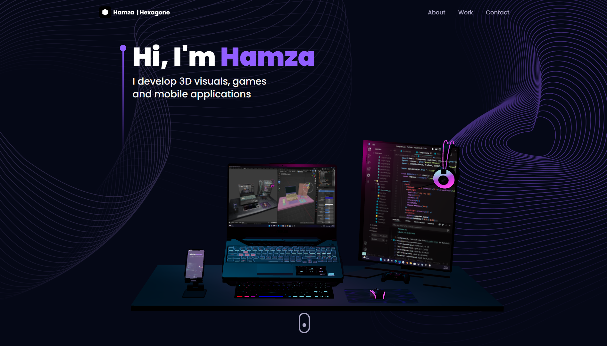

  

  <h1>Three.js 3D Portfolio</h1>
  
  

    Three.js 3D Portfolio is a modern UI/UX and functional Developer Portfolio Web built with React & Three.js
  

   
 <h4>
    <a href="https://hmmza-portfolio.vercel.app/">View Demo</a>
  </h4>

 

## :star2: About the Project

This repository houses an well-designed and functional Developer Portfolio Website consisting Navbar, Hero, Overview, Work Experience, Technologies, Projects, Testimonials and Contact sections built with React & Three.js using TailwindCSS ⏭

<!-- TechStack -->
### :space_invader: Tech Stack

## Request Source Code Method:

To request the source code of this project, please follow the guidelines mentioned in the repository's [Source Code Request Template](https://github.com/Hmmza-tariq/Portfolio-request/issues/new/choose). We appreciate your interest in exploring and collaborating with our codebase!

